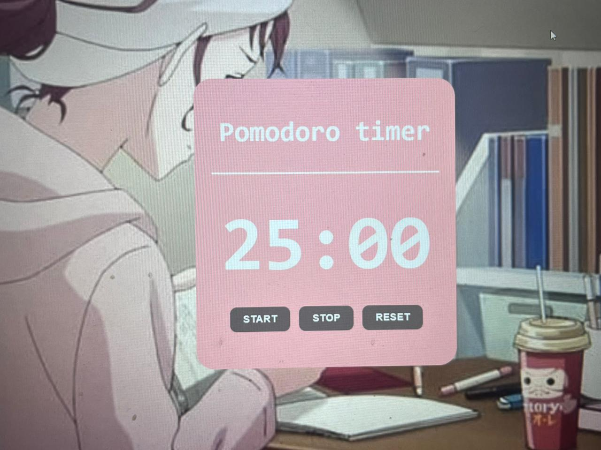

# ⏳ Pomodoro Timer with 🎶 Lofi Music

## 📝 Overview
A simple **Pomodoro Timer** built using **HTML, CSS, and JavaScript**.  
This timer follows the **Pomodoro technique** – focus for **25 minutes** and take a short break.  
To improve focus, **Lofi music** plays during your session, and a **notification sound** alerts you when the timer ends.  

---

## ✨ Features
- ⏱ **25-minute countdown timer** (1500 seconds)  
- 🎶 **Lofi background music** to help improve concentration  
- 🔔 **Alert sound** when the timer ends  
- 🖱 **Start**, **Stop**, and **Reset** buttons  
- 🎨 **Clean, minimal design**

---

## 🧠 Why Lofi Music?
- 🎵 **Steady beats** help calm the mind  
- 💤 **No distracting lyrics**, so you can focus better  
- 📖 **Popular for studying and deep work sessions**  

---

## 🛠️ Technologies Used
- **HTML5** – Page structure  
- **CSS3** – Styling & layout  
- **JavaScript (Vanilla)** – Timer logic, sounds, and events  

---

## 📚 JavaScript Concepts Used
1. **DOM Manipulation**  
   - `document.getElementById()` to grab HTML elements  
   - `element.innerHTML` to update the timer dynamically  

2. **Event Listeners**  
   - `addEventListener("click", ...)` to detect button clicks  

3. **Functions**  
   - `startTimer()`, `stopTimer()`, `resetTimer()`, `updateTimer()` for structured code  

4. **Variables**  
   - `let` and `const` for storing time, interval, and audio objects  

5. **Audio API**  
   - `new Audio()` to load sounds  
   - `play()`, `pause()`, `currentTime`, `volume`, `loop` for audio control  

6. **Timers**  
   - `setInterval()` for countdown  
   - `clearInterval()` to stop the countdown  

7. **Math Functions**  
   - `Math.floor()` and `%` operator to calculate minutes and seconds  

8. **Template Literals**  
   - Use of backticks and `${}` for clean string formatting  

9. **String Methods**  
   - `padStart()` to display numbers as `03` instead of `3`  

10. **Conditional Logic**  
    - `if (timeLeft === 0)` to trigger alarm and reset  

---

## 📂 File Structure
/pomodoro-timer
│── index.html # HTML structure
│── style.css # Styling (CSS)
│── index.js # Timer logic & sound
│── mixkit-alert-alarm-1005.wav # Alarm sound
│── mixkit-sleepy-cat-135.mp3 # Lofi music
│── studying.jpg # Background image

---

## 🚀 How to Use
1. **Start the Timer** → Click `Start` to begin the countdown and play lofi music.  
2. **Pause Anytime** → Click `Stop` to pause the timer and music.  
3. **Reset** → Click `Reset` to return the timer to `25:00`.  
4. **Focus & Work** → Enjoy the relaxing background music to stay productive.  

---

## 🔮 Future Improvements
- ⏲ Custom work/break durations  
- 🎶 Toggle music ON/OFF  
- 📊 Track completed Pomodoro sessions  
- 🌗 Dark/Light mode  

---
## 📷 Screenshot

## 🌐 Hosting
This project can be hosted easily using:  
- **GitHub Pages**  
- **Netlify**  
- **Vercel**  

---

## 👩‍💻 Author
Made with ❤️ using **HTML**, **CSS**, and **JavaScript**.  

